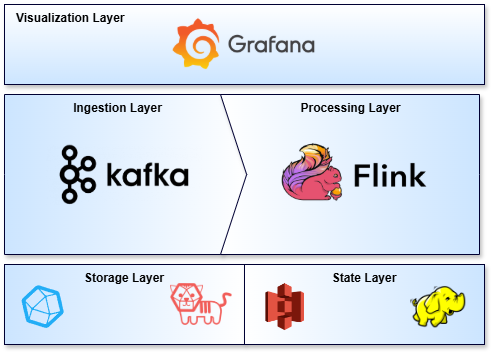
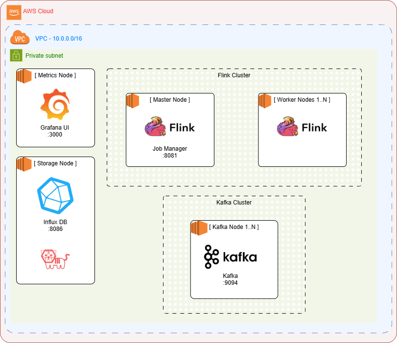
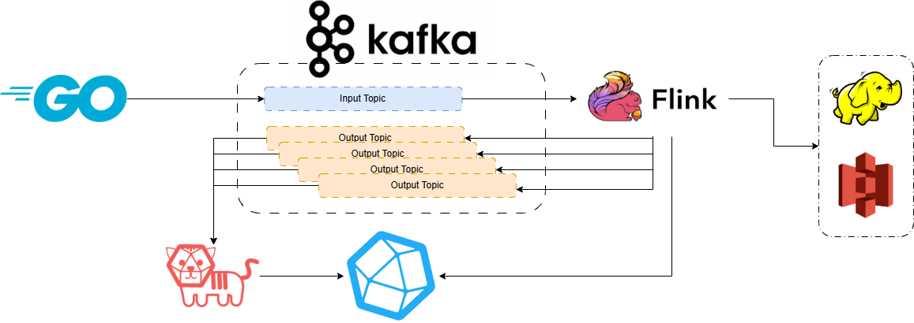

# Sky Analytics Stream (SAS)
> **Systems and Architectures for Big Data [SABD]** — *Università degli Studi di Roma "Tor Vergata"*
> Una Pipeline Stream Distribuita, Decoupled e Fault-Tolerant per l'Analisi in Tempo Reale dei Voli Domestici negli Stati Uniti (Gen–Apr 2025).

---

<p align="center">
  
  
  
  
  
  
  
  
  
  
</p>

---

## Panoramica del Progetto
**Sky Analytics Stream (SAS)** è una piattaforma distribuita di elaborazione dati in tempo reale (*Stream Processing*) altamente modulare, scalabile e resiliente, progettata per l'acquisizione, l'elaborazione a bassa latenza, il monitoraggio prestazionale e la visualizzazione analitica dei flussi di voli civili negli Stati Uniti.

Prendendo come riferimento il dataset storico dei voli commerciali del quadrimestre **Gennaio–Aprile 2025** (Bureau of Transportation Statistics), il sistema simula l'arrivo in tempo reale degli eventi nel tempo logico dell'applicazione (*Event-Time*) tramite un simulatore ad alte prestazioni sviluppato in **Go 1.24**, in grado di iniettare i record su **Apache Kafka 4.3.1-rc** applicando fattori di accelerazione temporale variabili e introducendo disordine temporale controllato (*out-of-orderness*).

La componente computazionale, realizzata in **Apache Flink 2.2.1** ed eseguita su **Java 21**, elabora il flusso tramite un'unica topologia ottimizzata a grafo aciclico diretto (DAG), calcolando in parallelo tre differenti query di business. L'infrastruttura è stata validata ed analizzata sia in locale che in ambiente distribuito multi-nodo su macchine **AWS EC2**, valutando la scalabilità al variare del parallelismo ($P \in \{1, 3, 6\}$), l'efficacia delle politiche di watermarking/allowed lateness per la gestione dei dati tardivi, e l'overhead/ripristino indotto da checkpoint incrementali gestiti da RocksDB con semantica *Exactly-Once*. La memorizzazione persistente dei checkpoint è affidata a un cluster **Hadoop HDFS 3.3.2** nell'ambiente locale e direttamente ad **Amazon S3** in ambiente AWS EC2.

---

## Architettura del Sistema e Flusso Dati

Di seguito vengono illustrati i diagrammi logici e fisici che compongono l'architettura della piattaforma SAS:

### 1. Big Data Stack (Dettaglio Tecnologico)
Rappresenta la scomposizione a livelli della pipeline (Ingestion, Buffer, Processing, Persistency, Visualization e Monitoring).


### 2. Vista di Deployment (Topologia dei Nodi AWS EC2)
Mostra l'infrastruttura distribuita multi-nodo instanziata in AWS all'interno di una VPC dedicata con DNS Route53 privato.


### 3. Diagramma di Interazione (Flusso dei Dati)
Illustra il percorso temporale seguito da un evento volo a partire dalla lettura del dataset Parquet fino alla visualizzazione grafica su Grafana.


---

## Struttura delle Directory e dei File
La struttura del repository riflette rigorosamente la modularità dell'architettura e la suddivisione delle responsabilità (*Separation of Concerns*). Di seguito viene dettagliato lo scopo di ciascuna cartella e dei file chiave:

```text
├── deploy/                    # Script di Deployment ed Automazione per Cluster VM Multi-Nodo
│   ├── compose/               # Docker-compose per servizi specifici (Flink, Kafka, InfluxDB, ecc.)
│   ├── configs/               # Configurazioni per il boot dei nodi del cluster (Flink, Kafka, Telegraf)
│   ├── template/              # Template AWS CloudFormation (cluster-vpc.yaml, cluster-node.yaml)
│   └── *.sh e *.bat           # Script di orchestrazione globale per deploy, rete e bucket S3
├── docs/                      # Documentazione e traccia ufficiale di progetto
│   └── SABD2526_Progetto2.pdf # Traccia e requisiti del secondo progetto
├── Report/                    # Relazione Tecnica Relativa al Progetto
│   ├── report.tex             # Sorgente LaTeX della relazione tecnica
│   ├── report.pdf             # PDF compilato della relazione tecnica del progetto (DOCUMENTAZIONE PRINCIPALE)
│   └── graphs/                # Grafici di telemetria e diagrammi architetturali
├── Results/                   # Risultati Sperimentali delle Esecuzioni
│   ├── charts/                # Grafici ed immagini delle performance estratti da Grafana
│   └── csv/                   # File CSV contenenti i dati prestazionali grezzi registrati
├── flink/                     # Processing Layer (Apache Flink Job in Java Maven)
│   ├── src/main/java/it/uniroma2/sae/  # Albero dei sorgenti Java (Java 21)
│   │   ├── config/            # Caricamento configurazioni (Kafka, Flink, Checkpoint)
│   │   ├── metrics/           # Tracciatori personalizzati di latenza ed eventi tardivi tramite DDSketch
│   │   ├── model/             # Schemi di deserializzazione e POJO dei voli (FlightRecord)
│   │   ├── preprocessing/     # Filtri di pre-processing e pulizia anomalie logiche
│   │   ├── query/             # Logica analitica distribuita delle tre query
│   │   │   ├── components/    # Filtri di compagnia ed aeroporti attivi
│   │   │   ├── performance/   # Query 1: Statistiche operative compagnie (Tumbling Window 1h)
│   │   │   ├── rank/          # Query 2: Classifiche aeroporti critici (Window 1h, 6h, Stato Storico Globale)
│   │   │   └── distribution/  # Query 3: Distribuzione dei ritardi (1d, 7d, Globale tramite DDSketch)
│   │   ├── sink/              # Builder per i sink di output su Kafka
│   │   ├── source/            # Builder per la KafkaSource con gestione dell'Event Time
│   │   └── FlightAnalysisJob.java # Main entry point del Job Flink (DAG unica)
│   └── pom.xml                # Configurazione Maven e dipendenze esterne
├── hadoop/                    # File di configurazione per il cluster HDFS (core-site.xml, hdfs-site.xml)
├── simulator/                 # Ingestion Engine (Go Application)
│   ├── engine/                # Core di replay logico in event-time e iniezione ritardi controllati
│   ├── models/                # Strutture dati dei record aeronautici
│   ├── config/                # Parser di variabili d'ambiente ed impostazioni YAML
│   ├── Dockerfile             # Ricetta di containerizzazione per il simulatore
│   └── main.go                # Entry point per la generazione dello stream verso Kafka
├── telegraf/                  # Configurazione del demone Telegraf 1.31
├── grafana/                   # Dashboard e provisioning per la visualizzazione delle performance e dei risultati
├── influxdb/                  # Script di inizializzazione e configurazione per lo storage a serie temporali InfluxDB 2.7
├── docker-compose.yml         # Orchestrazione locale Docker Compose per testare l'intera pipeline (HDFS, Kafka, Flink, ecc.)
├── example.env                # Template per le variabili d'ambiente necessarie allo stack
└── PLANNING.md                # Note di pianificazione, tuning prestazionale e architettura
```

> [!TIP]
> **Dove Trovare la Documentazione Tecnica?**
> La documentazione completa che descrive l'analisi matematica delle query, le valutazioni sperimentali di scalabilità (parallelismo $1, 3, 6$), la gestione del disordine temporale ($30$ min delay, allowed lateness) e i test di resilienza/ripristino si trova nella cartella [Report/](file:///home/flavio/Projects/SABD/flight-streaming-distributed-analysis/Report/) (in particolare, vedere il file compilato [report.pdf](file:///home/flavio/Projects/SABD/flight-streaming-distributed-analysis/Report/report.pdf)).

---

## Guida all'Avvio (Locale e AWS)

### 1. Esecuzione in Locale (Docker Compose)
Il deploy locale avvia tutti i servizi necessari (HDFS, Kafka, InfluxDB, Telegraf, Grafana, Flink JobManager e TaskManagers) all'interno di un'unica macchina tramite Docker Compose.

#### Step 1: Configurazione ambiente
Copiare il file delle variabili d'ambiente e configurare i parametri desiderati:
```bash
cp example.env .env
```

#### Step 2: Preparazione del dataset
Inserire il file compresso contenente i voli (es. `project-1-data.tar.gz` o `flights.parquet`) all'interno della directory dei dati del simulatore:
```bash
mkdir -p simulator/data
cp <percorso_del_dataset>/project-1-data.tar.gz simulator/data/
```

#### Step 3: Avvio dello stack infrastrutturale
Lanciare lo stack tramite Docker Compose (in modalità *detached*):
```bash
docker compose up -d
```
*Questo comando avvia il cluster HDFS (namenode e datanodes), Kafka (con topic auto-creati dal container `init-kafka`), InfluxDB (inizializzato via script in `influxdb/`), Telegraf, Grafana e i nodi Flink.*

#### Step 4: Compilazione del Job Flink
Posizionarsi nella cartella `flink/` e compilare il codice sorgente del Job per generare il pacchetto JAR:
```bash
cd flink
mvn clean package
cd ..
```
Il JAR compilato sarà disponibile in `flink/target/flight-analysis-1.0.jar`.

#### Step 5: Invio del Job ad Apache Flink
Accedere alla Flink Web Dashboard all'indirizzo `http://localhost:8081`, caricare manualmente il file JAR ed eseguirlo, oppure utilizzare la CLI di Flink (se installata localmente):
```bash
flink run -d -c it.uniroma2.sae.FlightAnalysisJob flink/target/flight-analysis-1.0.jar
```

#### Step 6: Avvio del Simulatore Go
Posizionarsi nella directory del simulatore ed avviare lo script locale per compilare ed eseguire il produttore di eventi:
```bash
cd simulator
chmod +x run.sh
./run.sh
```
*Il simulatore leggerà il dataset, applicherà le impostazioni d'ambiente di accelerazione e comincerà ad iniettare record nel topic Kafka `flights-stream`.*

---

### 2. Esecuzione Distribuita su AWS EC2 (Automazione Deploy)
Il deploy su AWS EC2 sfrutta script bash e template CloudFormation per creare un'infrastruttura di rete VPC isolata ed istanziare macchine virtuali EC2 dedicate per ciascun servizio.

#### Step 1: Prerequisiti
1. Installare e configurare l'**AWS CLI** con credenziali di amministratore (o privilegi IAM adeguati per VPC, CloudFormation, S3, EC2, Route53).
2. Assicurarsi di disporre di **Maven (mvn)** locale per compilare il Job Flink.

#### Step 2: Configurazione dell'ambiente di Deploy
Spostarsi nella cartella `deploy/` e copiare il template di configurazione:
```bash
cd deploy
cp .env.example .env
```
Modificare `.env` inserendo la regione AWS (`REGION`), il nome del bucket S3 per gli asset (`BUCKET_NAME`), il nome della chiave SSH (`SSH_KEY_NAME`) e la directory locale in cui salvarla (`SSH_KEY_DIR`).

#### Step 3: Compilazione locale del JAR Flink
Prima di avviare il deploy, compilare il Job Flink per generare il JAR aggiornato:
```bash
cd ../flink
mvn clean package
cd ../deploy
```

#### Step 4: Lancio della Pipeline di Deploy
Eseguire lo script globale di orchestrazione:
```bash
chmod +x start_all_deploy.sh deploy-network.sh init-bucket.sh deploy-node.sh
./start_all_deploy.sh
```
Questo script eseguirà in cascata i seguenti passaggi automatici:
1. **Network Provisioning (`deploy-network.sh`)**: Crea lo stack di rete CloudFormation (`cluster-vpc.yaml`) comprendente VPC, Subnet, Route Tables, Security Group privato e la Hosted Zone privata di Route53 (`flight-analysis.local`).
2. **S3 Synchronization (`init-bucket.sh`)**: Crea il bucket S3 configurato, ne struttura le directory interne (`logs/`, `deploy/`, `flink/`, `telegraf/`, `influxdb/`, `grafana/`) e carica il file JAR compilato (`flight-analysis.jar`) insieme alle ricette locali.
3. **VM Cluster Provisioning (`deploy-node.sh all`)**: Crea le istanze EC2 via CloudFormation (`cluster-node.yaml`). Al bootstrap di ciascuna macchina, viene eseguito uno script di inizializzazione che installa Docker, scarica i Docker Compose dedicati da S3 (in `deploy/compose/`) ed avvia i relativi servizi.

#### Step 5: Avvio della Simulazione su AWS
Per avviare l'elaborazione su AWS:
1. Collegarsi all'istanza EC2 designata come generatore di traffico o al nodo Kafka.
2. Posizionare il dataset Parquet aeronautico nella directory `data/` del nodo.
3. Avviare la simulazione tramite lo script:
   ```bash
   ./scripts/run-simulation.sh
   ```
   *Lo script preleverà l'immagine Docker pre-costruita del simulatore (`fmasci/sae-simulator:0.1.0`) e comincerà a riprodurre lo streaming verso il broker Kafka distribuito (`kafka.flight-analysis.local:9094`).*

---

## Stack Tecnologico e Ruolo dei Componenti
L'architettura segue il paradigma del **disaccoppiamento logico** ed è composta dai seguenti componenti:

1. **Simulatore Go (Go 1.24)**: Legge il dataset storico in formato Parquet (2.2 milioni di righe), controlla il ritmo di invio dei messaggi preservando i distacchi temporali originali contratti di un fattore di accelerazione ($1.440x$, $14.400x$, $43.200x$) e applica ritardi artificiali (fino a 30 minuti con probabilità del 5%) per simulare i ritardi reali.
2. **Apache Kafka (4.3.1-rc)**: Message broker distribuito che agisce da buffer resiliente. Ospita il topic di ingresso `flights-stream` (con 6 partizioni per scalare con il parallelismo) e i topic di output specifici per i risultati delle query.
3. **Apache Flink (2.2.1 su Java 21)**: Motore di calcolo distribuito che consuma lo stream da Kafka ed elabora i dati basandosi sull'*Event-Time* estratto da ciascun volo. Esegue filtri, aggregazioni incrementali in finestra e mantiene lo stato distribuito.
4. **Hadoop HDFS (3.3.2) / Amazon S3 (State Storage)**: 
   * *In locale*: Flink TaskManager e JobManager si appoggiano a un cluster HDFS locale (`hdfs-master`, `hdfs-worker-1`, `hdfs-worker-2`) per memorizzare in modo distribuito i file di checkpoint di RocksDB. Le librerie di HDFS sono condivise con Flink tramite Docker volume (`hadoop-shared`).
   * *Su AWS EC2*: La persistenza dei checkpoint viene effettuata direttamente su **Amazon S3** abilitando il plugin nativo di Flink `flink-s3-fs-hadoop`.
5. **Telegraf (1.31)**: Agente di ingestion leggero che consuma i risultati analitici emessi da Flink sui topic Kafka di output. Configurato con un processore **Starlark script custom** per decodificare il JSON ed effettuare il cast esplicito dei campi e degli array annidati prima della persistenza su InfluxDB.
6. **InfluxDB (2.7)**: Database ottimizzato per serie temporali (*Time Series Database*) che funge da storage consolidato sia per le metriche analitiche che per le telemetrie delle performance.
7. **Grafana**: Piattaforma di visualizzazione che interroga InfluxDB per alimentare due dashboard in tempo reale: una dedicata ai risultati di business ed una incentrata sulle metriche prestazionali di Flink e delle risorse delle VM AWS. Le metriche di telemetria del cluster Flink (CPU, JVM GC, pause, throughput) vengono scritte direttamente da Flink TaskManager ad InfluxDB tramite il reporter nativo `org.apache.flink.metrics.influxdb.InfluxdbReporterFactory`.

## Dettagli di Ottimizzazione della DAG di Flink
Per ottimizzare l'I/O e l'occupazione di memoria su JVM, l'intera pipeline di Flink è implementata all'interno di una **DAG Singola**:
* **Sorgente Unica**: Una singola istanza di `KafkaSource` legge i dati da Kafka, evitando letture e deserializzazioni multiple dello stesso byte array.
* **Strategia di Watermarking Globale**: L'assegnazione dei watermark avviene immediatamente a valle della sorgente per garantire che il tempo logico avanzi in modo sincrono su tutti gli operatori.
* **Aggregazioni Incrementali**: Per tutte e tre le query, l'elaborazione nelle finestre temporali viene eseguita tramite `AggregateFunction` incrementali che mantengono in memoria solo un accumulatore compatto di stato costante $O(1)$, evitando di bufferizzare l'elenco dei singoli record fino alla chiusura della finestra.
* **Stima Percentile tramite DDSketch**: Nella Query 3 e nel monitoraggio delle latenze di processing/lateness, al fine di stimare la distribuzione dei percentili dei ritardi su finestre lunghe ed orizzonti globali senza esaurire la memoria Heap, viene utilizzata la libreria ufficiale **DDSketch** di Datadog (`sketches-java`). Questo consente una stima ad occupazione di memoria fissa con garanzie di errore relativo limitato, evitando il bufferizzamento in memoria di milioni di record.

## Resilienza e Consistenza
SAS implementa un sistema di tolleranza ai guasti robusto in grado di ripristinare lo stato a seguito di crash fisici dei nodi worker:
* **RocksDB State Backend**: Utilizzato per gestire lo stato di grandi dimensioni (finestre da 6 ore e globali storiche) scaricando i dati sulla memoria secondaria locale ed eseguendo il backup asincrono verso lo storage distribuito.
* **Snapshot Incrementali**: I checkpoint vengono eseguiti salvando solo le differenze logiche rispetto al backup precedente, riducendo drasticamente il traffico di rete e la durata dello snapshot.
* **Consistenza Exactly-Once End-to-End**: In caso di fallimento di un TaskManager, il JobManager ripristina lo stato delle finestre e degli accumulatori recuperando l'ultimo checkpoint consistente e riposizionando i consumatori Kafka sugli offset storici. L'idempotenza intrinseca di InfluxDB (la sovrascrittura di record con la stessa chiave e timestamp logico di finestra) impedisce che la riesecuzione dei record compresi tra l'ultimo checkpoint e l'istante di crash generi duplicazioni visibili a livello analitico.